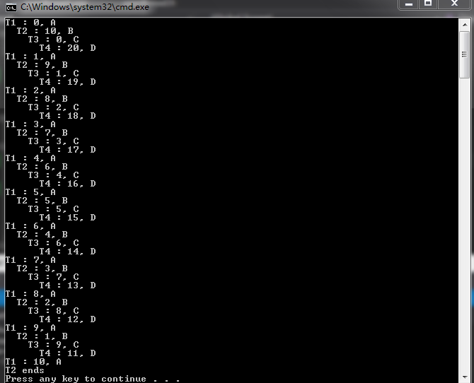

# 构建用户级线程库
模仿Windows的Fiber，实现了一套用户级线程函数库.用户线程的调度、context和栈的切换均使用汇编实现，整个过程唯一使用的系统API是`HeapAlloc/HeapFree`，将分配的堆内存用作用户线程的栈.

[题目说明文档](./document.md)

## 测试结果:

## 说明
`yield_thread`是使其他用户线程获得CPU的唯一方式.这意味着如果一个线程函数A在结束前未调用`yield_thread`，那么其他用户线程将无法再次获得CPU，他们都将同线程A一起终止.所有用户线程终止后，`start_threads`返回.

## 实现过程中遇到的问题
1. 未正确保存和恢复context，导致函数退出后无法通过堆栈安全检查
2. 为用户线程分配的栈空间过小，造成溢出
